# Koi Blog - Architecture Diagrams

## 🎯 Overview
This document contains visual representations of the Koi Blog system architecture, including system overview, data flow, and component relationships.

## 🏗️ System Architecture Overview

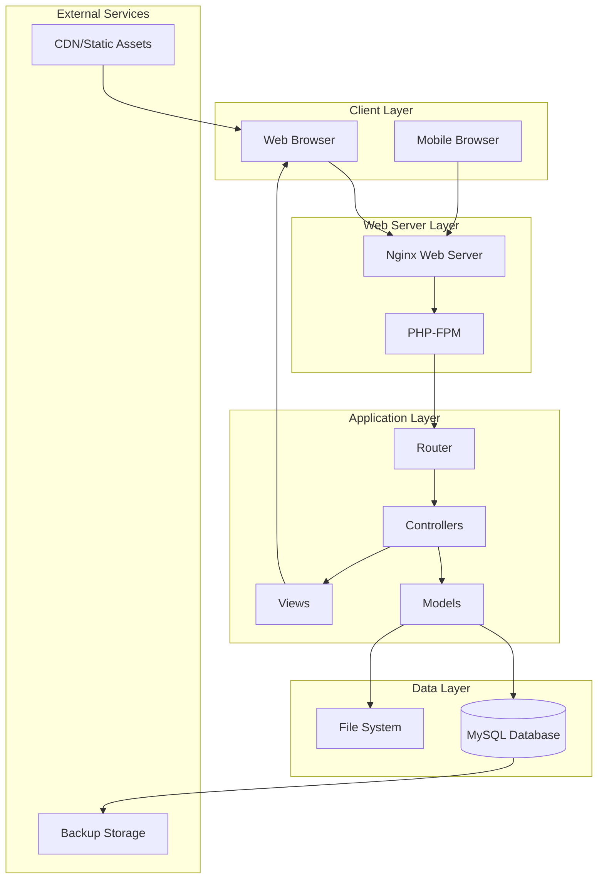

## 🔄 Request Flow Diagram

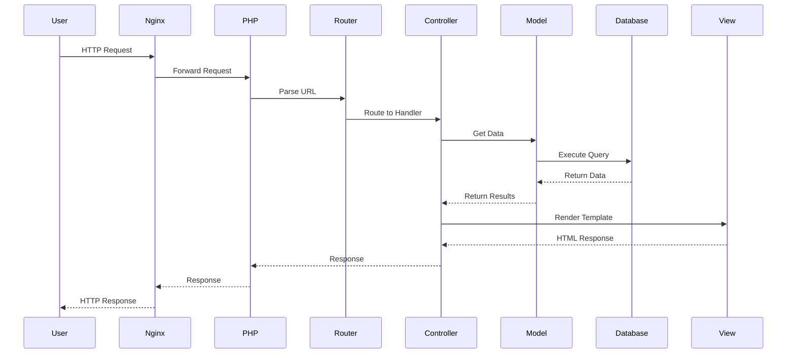

## 📊 Domain Model Diagram

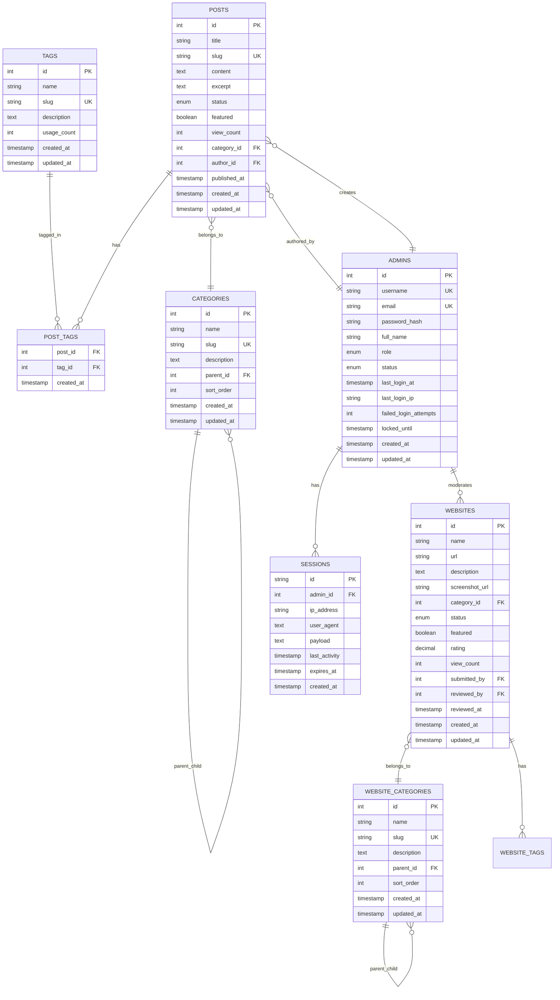

## 🏛️ MVC Architecture Diagram

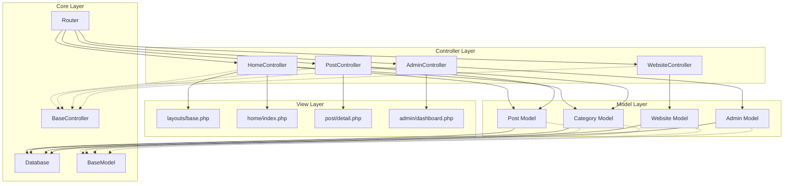

## 🔐 Security Architecture

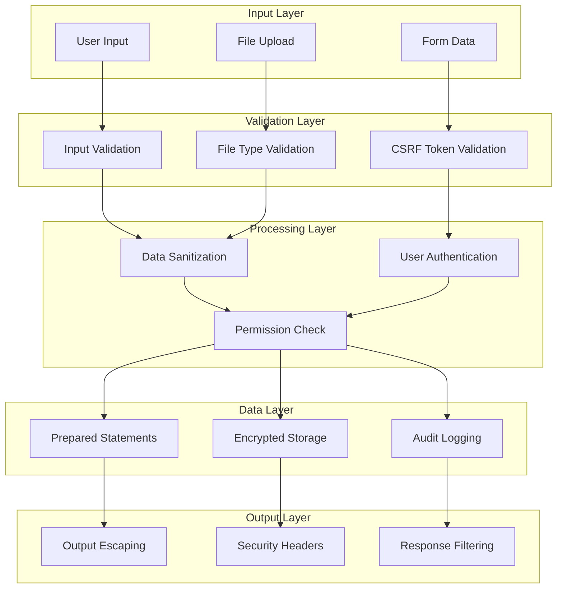

## 🚀 Deployment Architecture

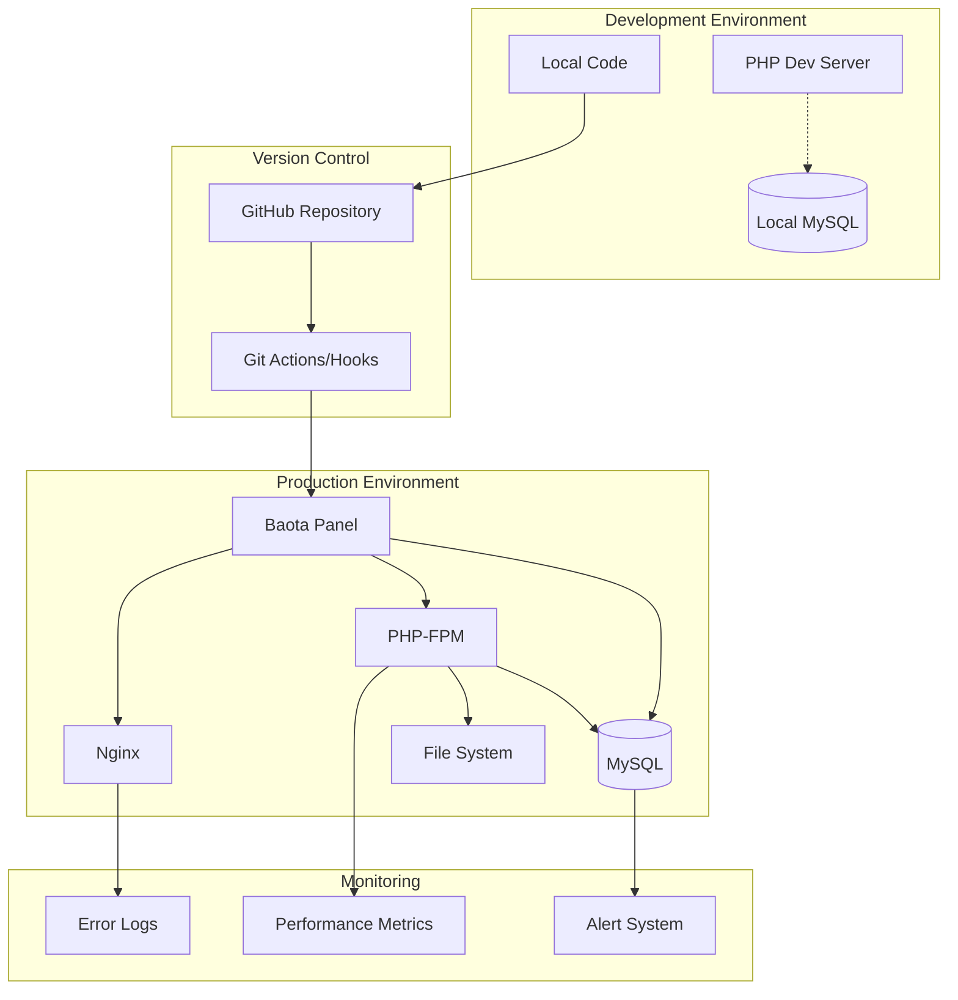

## 📱 Responsive Design Architecture

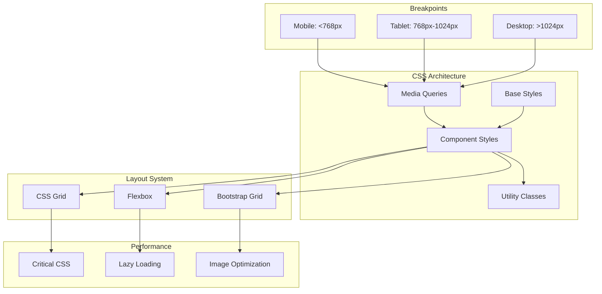

## 🔄 Data Flow Diagram

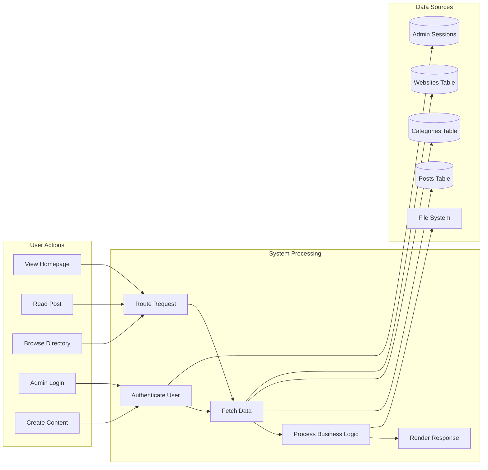

## 🧪 Testing Architecture

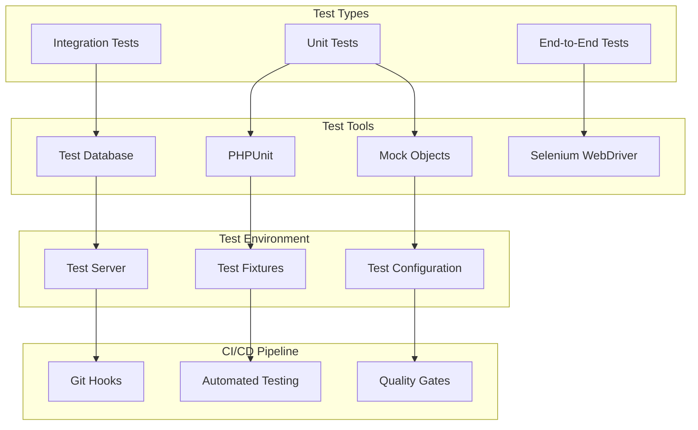

## 📊 Performance Monitoring Architecture

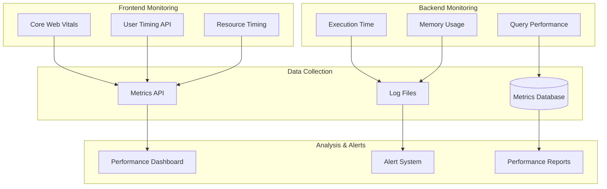

## 🔧 Component Interaction Diagram

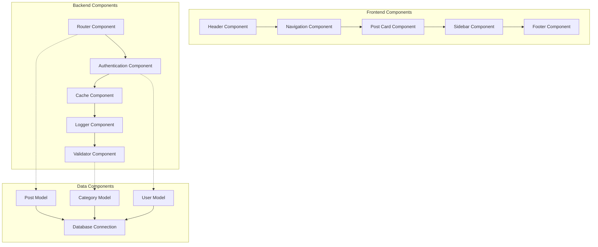

---

## 📝 Diagram Usage Guidelines

### When to Update Diagrams
- **Architecture Changes**: Update when system architecture evolves
- **New Components**: Add new components to relevant diagrams
- **Data Model Changes**: Update ERD when database schema changes
- **Security Updates**: Modify security diagrams when security measures change

### Diagram Maintenance
- **Monthly Review**: Check diagrams for accuracy
- **Version Control**: Keep diagrams in sync with code changes
- **Documentation**: Update related documentation when diagrams change
- **Stakeholder Review**: Share updated diagrams with team members

### Tools for Diagram Creation
- **Mermaid**: For text-based diagrams (recommended)
- **Draw.io**: For complex visual diagrams
- **PlantUML**: For UML diagrams
- **Lucidchart**: For collaborative diagramming
