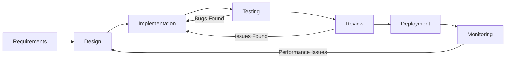
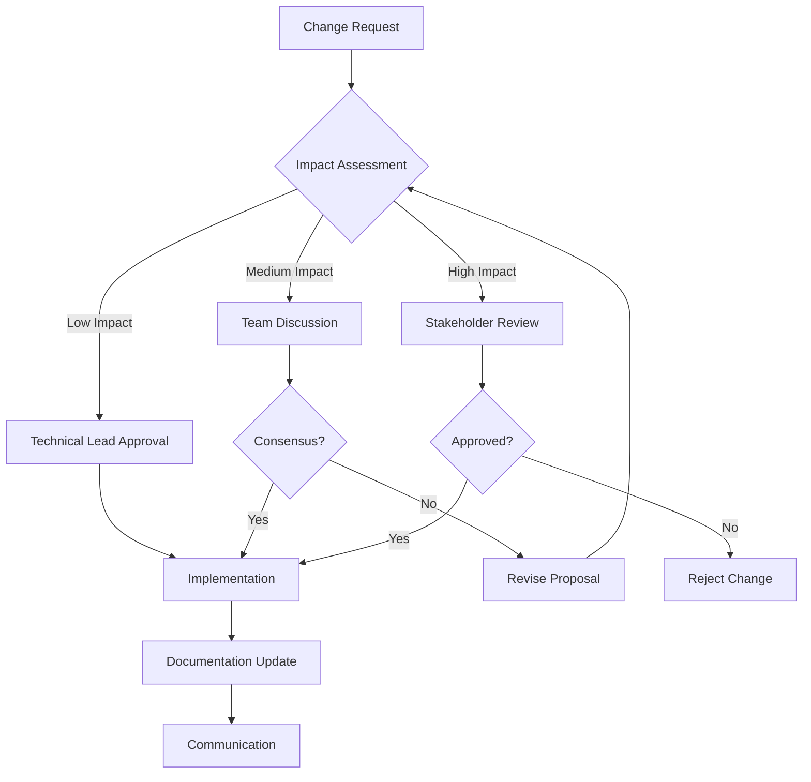
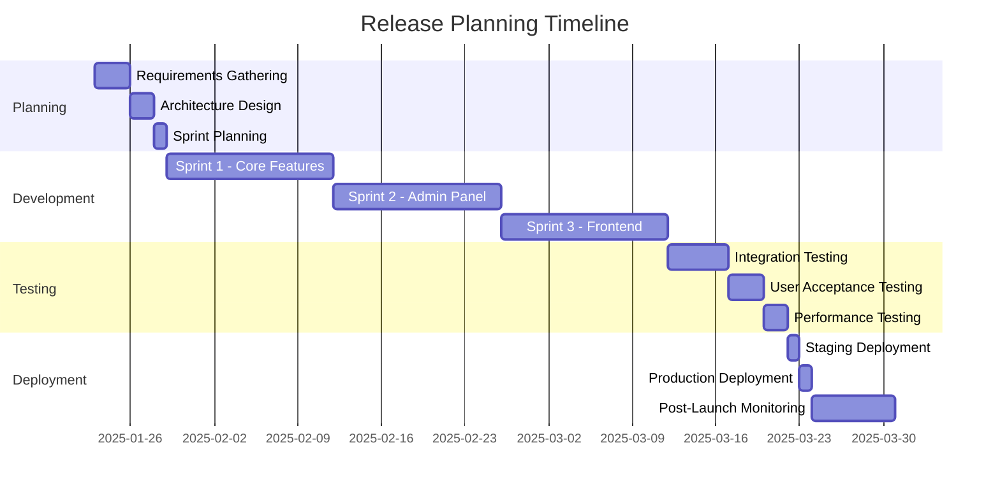

# Koi Blog - Project Governance Framework

## 🎯 Governance Philosophy
Project governance ensures consistent decision-making, quality standards, and sustainable development practices. We balance agility with structure to maintain project health and team productivity.

## 👥 Roles and Responsibilities

### Project Roles
```
Technical Lead (老王)
├── Architecture decisions and technical direction
├── Code review and quality assurance
├── Performance optimization and security
└── Mentoring and knowledge transfer

Developer
├── Feature implementation and bug fixes
├── Unit testing and documentation
├── Code review participation
└── Continuous learning and improvement

Stakeholder/Product Owner
├── Requirements definition and prioritization
├── User acceptance testing
├── Business decision making
└── Project scope management
```

### Decision Authority Matrix
| Decision Type | Technical Lead | Developer | Stakeholder |
|---------------|----------------|-----------|-------------|
| Architecture Changes | **Decide** | Consult | Inform |
| Technology Stack | **Decide** | Input | Inform |
| Feature Requirements | Consult | Input | **Decide** |
| Code Standards | **Decide** | Input | Inform |
| Release Planning | Consult | Input | **Decide** |
| Security Policies | **Decide** | Input | Consult |
| Performance Targets | **Decide** | Input | Consult |

## 📋 Development Process

### Feature Development Lifecycle


### Definition of Done (DoD)
A feature is considered "Done" when:

#### Code Quality
- [ ] Code follows established coding standards
- [ ] All functions have appropriate documentation
- [ ] No code smells or technical debt introduced
- [ ] Security best practices implemented

#### Testing
- [ ] Unit tests written and passing (>80% coverage)
- [ ] Integration tests for critical paths
- [ ] Manual testing completed
- [ ] No known bugs or regressions

#### Documentation
- [ ] User-facing features documented
- [ ] API changes documented
- [ ] Architecture decisions recorded (ADR)
- [ ] Deployment notes updated

#### Security & Performance
- [ ] Security review completed
- [ ] Performance impact assessed
- [ ] No new security vulnerabilities
- [ ] Performance targets met

#### Deployment
- [ ] Code reviewed and approved
- [ ] Deployment tested in staging
- [ ] Rollback plan prepared
- [ ] Monitoring alerts configured

### Code Review Process

#### Review Criteria
```markdown
## Code Review Checklist

### Functionality
- [ ] Code does what it's supposed to do
- [ ] Edge cases are handled
- [ ] Error handling is appropriate
- [ ] Business logic is correct

### Code Quality
- [ ] Code is readable and well-structured
- [ ] Naming conventions followed
- [ ] No code duplication
- [ ] Appropriate design patterns used

### Security
- [ ] Input validation implemented
- [ ] Output escaping applied
- [ ] SQL injection prevention
- [ ] Authentication/authorization correct

### Performance
- [ ] No obvious performance issues
- [ ] Database queries optimized
- [ ] Caching used appropriately
- [ ] Resource usage reasonable

### Testing
- [ ] Adequate test coverage
- [ ] Tests are meaningful
- [ ] Tests pass consistently
- [ ] Mock objects used appropriately
```

#### Review Process
1. **Self-Review**: Developer reviews own code before submission
2. **Peer Review**: Another developer reviews the code
3. **Technical Lead Review**: Technical lead reviews for architecture compliance
4. **Approval**: Code approved for merge after all reviews pass

## 🔄 Change Management

### Architecture Decision Records (ADR)
All significant architectural decisions must be documented using ADR format:

```markdown
# ADR-XXXX: [Decision Title]

## Status
[Proposed | Accepted | Deprecated | Superseded]

## Context
[Describe the situation and problem]

## Decision
[Describe the decision and rationale]

## Consequences
[Describe positive and negative consequences]

## Alternatives Considered
[List other options and why they were rejected]
```

### Change Request Process


### Impact Assessment Criteria
- **Low Impact**: Bug fixes, minor improvements, documentation updates
- **Medium Impact**: New features, dependency updates, performance optimizations
- **High Impact**: Architecture changes, security modifications, major refactoring

## 📊 Quality Assurance

### Quality Gates
Each phase has specific quality gates that must be passed:

#### Development Phase
- [ ] Code compiles without errors
- [ ] All unit tests pass
- [ ] Code coverage >80%
- [ ] Static analysis passes
- [ ] Security scan passes

#### Testing Phase
- [ ] Integration tests pass
- [ ] Performance tests meet targets
- [ ] Security tests pass
- [ ] User acceptance criteria met
- [ ] Browser compatibility verified

#### Deployment Phase
- [ ] Staging deployment successful
- [ ] Smoke tests pass
- [ ] Performance monitoring active
- [ ] Rollback plan tested
- [ ] Documentation updated

### Metrics and KPIs
```markdown
## Development Metrics
- Code Coverage: >80%
- Bug Density: <1 bug per 100 lines of code
- Technical Debt Ratio: <5%
- Code Review Coverage: 100%

## Performance Metrics
- Page Load Time: <2 seconds
- Database Query Time: <100ms average
- Memory Usage: <64MB per request
- Uptime: >99.9%

## Security Metrics
- Vulnerability Count: 0 high/critical
- Security Test Coverage: 100% of endpoints
- Failed Login Attempts: <5% of total logins
- Security Incident Response: <1 hour
```

## 🚨 Risk Management

### Risk Assessment Matrix
| Risk Level | Probability | Impact | Response Strategy |
|------------|-------------|---------|-------------------|
| **Critical** | High | High | Immediate action required |
| **High** | High | Medium | Action plan within 24 hours |
| **Medium** | Medium | Medium | Monitor and plan mitigation |
| **Low** | Low | Low | Accept and document |

### Common Project Risks
```markdown
## Technical Risks
- **Database Performance**: Monitor query performance, optimize indexes
- **Security Vulnerabilities**: Regular security audits, dependency updates
- **Scalability Issues**: Performance testing, capacity planning
- **Technical Debt**: Regular refactoring, code quality metrics

## Operational Risks
- **Deployment Failures**: Automated testing, rollback procedures
- **Data Loss**: Regular backups, disaster recovery plan
- **Service Downtime**: Monitoring, alerting, incident response
- **Knowledge Loss**: Documentation, knowledge sharing

## Business Risks
- **Scope Creep**: Clear requirements, change control process
- **Resource Constraints**: Capacity planning, priority management
- **Stakeholder Misalignment**: Regular communication, expectation management
- **Market Changes**: Flexible architecture, regular review cycles
```

## 📅 Project Planning

### Release Planning Process


### Sprint Planning Guidelines
- **Sprint Duration**: 2 weeks
- **Sprint Goals**: Clear, measurable objectives
- **Capacity Planning**: Account for 80% development time
- **Risk Buffer**: 20% time for unexpected issues

## 📞 Communication Framework

### Communication Channels
```markdown
## Regular Meetings
- **Daily Standups**: Progress updates, blockers (15 min)
- **Sprint Planning**: Sprint goals, task estimation (2 hours)
- **Sprint Review**: Demo completed features (1 hour)
- **Sprint Retrospective**: Process improvement (1 hour)

## Documentation
- **Technical Documentation**: Architecture, APIs, deployment
- **User Documentation**: Feature guides, troubleshooting
- **Process Documentation**: Workflows, standards, procedures
- **Decision Records**: ADRs, meeting minutes, change logs

## Escalation Process
1. **Level 1**: Team discussion and resolution
2. **Level 2**: Technical lead involvement
3. **Level 3**: Stakeholder escalation
4. **Level 4**: External expert consultation
```

### Stakeholder Communication
- **Weekly Status Reports**: Progress, risks, next steps
- **Monthly Reviews**: Metrics, performance, roadmap updates
- **Quarterly Planning**: Strategic alignment, resource planning
- **Ad-hoc Updates**: Critical issues, major decisions

## 🔧 Continuous Improvement

### Retrospective Process
```markdown
## Sprint Retrospective Format
1. **What Went Well**: Celebrate successes
2. **What Could Be Improved**: Identify pain points
3. **Action Items**: Specific improvements to implement
4. **Experiments**: New practices to try

## Improvement Tracking
- Action items assigned to specific team members
- Progress reviewed in next retrospective
- Successful practices documented and shared
- Failed experiments analyzed for lessons learned
```

### Knowledge Management
- **Technical Wiki**: Centralized knowledge repository
- **Code Documentation**: Inline comments, README files
- **Video Recordings**: Complex procedures, troubleshooting
- **Knowledge Sharing Sessions**: Regular team learning

## ✅ Governance Checklist

### Weekly Governance Review
- [ ] All code changes reviewed and approved
- [ ] Quality gates passed for completed features
- [ ] Risk register updated with new risks
- [ ] Metrics collected and analyzed
- [ ] Stakeholder communication completed

### Monthly Governance Audit
- [ ] Process adherence assessed
- [ ] Quality metrics reviewed
- [ ] Risk mitigation effectiveness evaluated
- [ ] Team feedback collected and addressed
- [ ] Governance framework updated as needed

### Quarterly Strategic Review
- [ ] Project goals alignment verified
- [ ] Resource allocation optimized
- [ ] Technology stack evaluated
- [ ] Market conditions assessed
- [ ] Long-term roadmap updated
